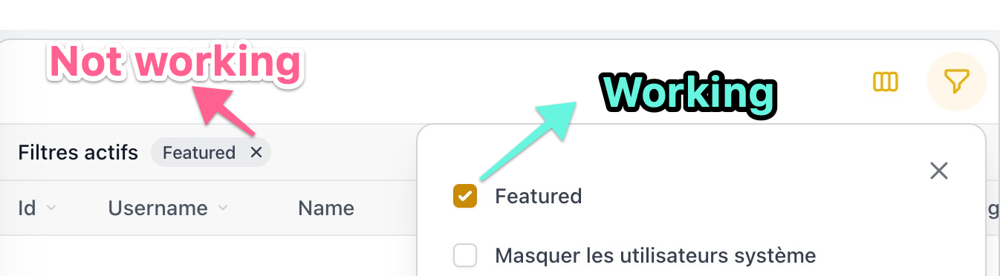

# Filament Bug Report

## Installation

```sh
git clone git@github.com:flyingeek/filament-bug-report.git

cd filament-bug-report

# This will also seed a sqlite database
composer install

php artisan serve
```

## Steps to reproduce

- open http://127.0.0.1:8000/admin/users
- try to deactivate the filter


